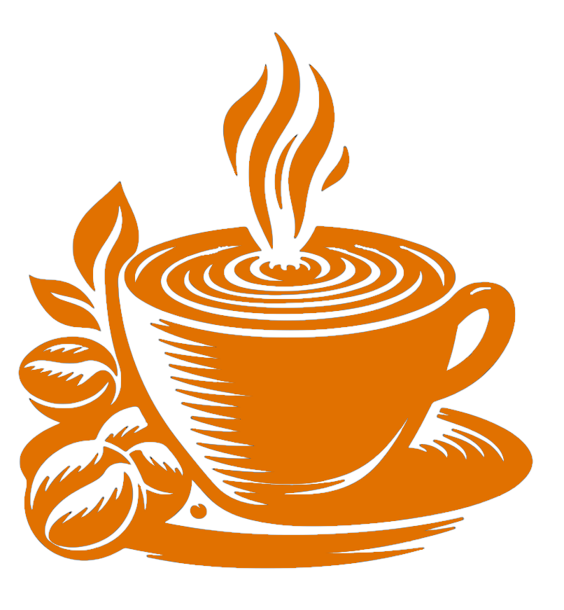

<p align="center">
  
  
</p>

<h1 align="center">☕ Moein Coffee — E-commerce Store with Next.js 15</h1>

<p align="center">
  <a href="./README.fa.md">
    
  </a>
</p>

<p align="center">
  
  
  
  
</p>

---

## 🚀 Project Overview
A modern, responsive e-commerce store built with **Next.js 15**, **React 19** and **TailwindCSS 4**.  
The project follows a modular architecture and features minimalist 3D-ish UI and developer-friendly patterns.

---

## ✨ Features

- 🔐 Secure JWT-based authentication (signup, login, logout, session management with access/refresh tokens and httpOnly cookies)  
- 🧺 Guest cart with automatic, idempotent merge upon user login  
- ⚡ Fast UX using Optimistic UI patterns to reduce perceived latency  
- 🧩 Clean, modular architecture (components, templates, modules, hooks, contexts)  
- ♻️ Shared frontend/backend validation with reusable schemas (e.g., Zod/Joi)  
- 🌐 Full RTL support and Persian localization  
- 🧪 Seed data for rapid local development and testing  
- 🎨 Minimal/modern UI built with TailwindCSS; fully responsive  
- 🔗 Versioned private API with OpenAPI docs and auth/cart endpoints  
- 📱 Custom mobile navigation and custom 404 page with accessibility (a11y) and RTL support

---

## 🛠 Tech Stack

<div align="center">
  
  
  
  
  
  
  
  
  
  
  
</div>

---

## 🖼️ Screenshots

### 🖥️ Desktop Screens
| Home Page | Products |
|-----------|---------|
|  |  |  |

| Articles | Auth Page |
|---------|-----------|
|  | |

### 📱 Mobile Screens
| Mobile | Mobile Cart | Mobile 404 Page |
|--------|------------|----------------|
|  |  |  |


---

## 🌐 Live Demo
🔗 [moein-coffee.vercel.app](http://moein-coffee.vercel.app/)

---

## 📚 API Documentation
Full API documentation: [Project_API_Documentation](./docs/Project_API_Documentation.md) 

---

## ⚡ Installation & Run (Backend + Frontend)

```bash
# Install dependencies
npm install
```

### Environment variables
Create a `.env` file in the project root with these values:

```env
MONGO_URL=mongodb://localhost:27017/moein-coffee
AccessTokenSecretKey=test
RefreshTokenSecretKey=test
```

> **Note:** `AccessTokenSecretKey` and `RefreshTokenSecretKey` above are sample/test values. Use strong, secret values in production.

### Import seed data
Import the two JSON files located in `configs/data` into your MongoDB database:

- `moein-coffee.articles.json`
- `moein-coffee.products.json`

Example using `mongoimport` (local MongoDB):
```bash
mongoimport --uri="mongodb://localhost:27017/moein-coffee" --collection=articles --file=./configs/data/moein-coffee.articles.json --jsonArray
mongoimport --uri="mongodb://localhost:27017/moein-coffee" --collection=products --file=./configs/data/moein-coffee.products.json --jsonArray
```

(You can also import via MongoDB Compass or Atlas UI if you prefer.)

### Run in development
```bash
npm run dev
```

### Build for production
```bash
npm run build
npm start
```

## 📜 License

© 2025 Moein Coffee — All Rights Reserved.

- This project is released under the proprietary license "All Rights Reserved © 2025 Moein Coffee".
- Any use, reproduction, distribution, modification, or exploitation of this project — whether personal, educational, or commercial — is prohibited without prior written permission from the copyright holder.
- The initial design of this project was inspired by a Figma design published by [Sabzlearn](https://sabzlearn.ir/). The final design has been significantly redesigned and developed by the author.


